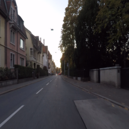
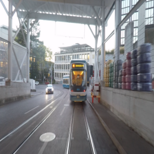
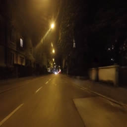
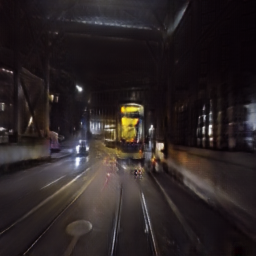

# CycleGAN
CycleGAN_daytime_to_nighttime
## style transform using cycleGAN 
this is one of my graduate project 
we want to improve night time segmentation
but night time segmentation is difficult due to samll dataset (image,segmentation mask) 
so we use cycleGAN, transfer daytime image to night time image to train night time image with daytime image's segmentation mask 
this cycleGAN code from this [repo](https://github.com/hanyoseob/youtube-cnn-007-pytorch-cyclegan)

## converted image
we use cityscapes data and dark zurich data to train CycleGAN 

so we can use nighttime segmentaton like model adaptation 
